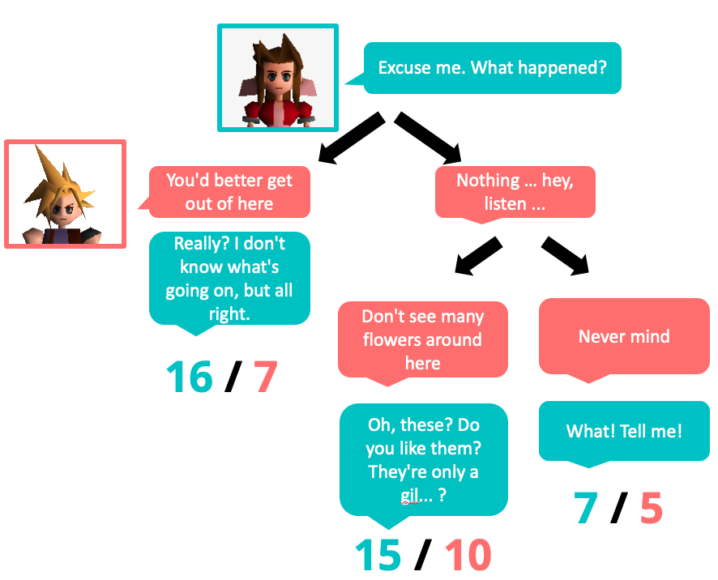

```{r echo=F,eval=F}
try(setwd("~/OneDrive - Cardiff University/Research/Cardiff/VideoGameScripts/project_public/analysis/"))
```

# Introduction

This report explores gender balance in dialogue when taking into account player choice. The first section studies choice within choice structures in the dialogue, providing a worked example from Final Fantasy VII. The second section looks at the effects of the player's choice of gender on the overall gender balance in dialogue.

# Load libraries

```{r}
library(rjson)
library(ggplot2)
library(tidyverse)
source("https://raw.githubusercontent.com/datavizpyr/data/master/half_flat_violinplot.R")
```

# Dialogue choices

We simulated an omnicient player who tries to maximise dialogue from one gender while  minimising the dialogue from another (without repeat encounters). 

## Example: FFVII

The figure below shows a dialogue tree from Final Fantasy VII. Aerith (blue) initiates a conversation with the player character (red). The total number of words spoken by each character is listed at the bottom of each branch of the tree. Depending on the player's decisions, they might experience 70% female dialogue (left), or 60% (middle) or 58% (right). 



There are various ways of measuring the variation created by possible choices. One way is to simulate a player that makes random decisions: for each dialogue tree, make a random choice of responses and record the proportions you observe. Alternatively, an omniscient player who had full knowledge of the dialogue tree could make choices to either maximise or minimise the proportion of female dialogue.

There are therefore several possible measures for the proportion of female dialogue:

-  The proportion of female dialogue written by the game authors (the main measure in the rest of the paper)
-  The range of proportions from a player making random decisions.
-  The proportion of female dialogue experienced if an omniscient player tried to maximise female dialogue.
-  The proportion of female dialogue experienced if an omniscient player tried to maximise male dialogue.

These measures were estimated using the script `processing/getChoiceVariation.py`. Proportions from a random player were estimated by creating 100 scripts from random decisions for each game without re-visiting any lines. For each of these random scripts, the proportion of female dialogue is calculated. Then we measure the mean of these proportions as well as the range of values (using a summary statistic like the 95% quantile is possible, but in practice the range of random options is very small). 

Proportions from an omniscient player were obtained by exhaustive search through each independent dialogue tree. This assumes that choice blocks in the main script level are independent, which is not always true (e.g. in Mass Effect, certain dialogue decisions at one point in the game affect which options are available later). However, obtaining this high-level data is difficult.

For the omnisicent player results, let's walk through an example from Final Fantasy VII. First, we load the data generated by the python script:

```{r}
folder = "../data/FinalFantasy/FFVII/"
d = read.csv(paste0(folder,"/choiceVariation.csv"),stringsAsFactors = F)
d = d[!is.na(d$maxM.femaleWords),]
```

We can now work out the "female advantage": the difference between the number of female words and the number of male words (higher than zero = more female words than male words).

```{r}
d$maxM.femaleAdvantage = d$maxM.femaleWords - d$maxM.maleWords
d$maxF.femaleAdvantage = d$maxF.femaleWords - d$maxF.maleWords
```

Collate data: for each dialogue tree, plot the distribution of female advantage for two strategies: maximising female dialogue and maximising male dialogue:

```{r}
dx = data.frame(
  FemaleAdvantage = c(d$maxF.femaleAdvantage,d$maxM.femaleAdvantage),
  Strategy = rep(c("Maximise Female dialogue","Maximise Male dialogue"),
                 times = c(nrow(d),nrow(d)))
  )
dx$Strategy = relevel(factor(dx$Strategy),"Maximise Male dialogue")

ggplot(dx, aes(x=FemaleAdvantage,color=Strategy)) +
  geom_density(bw=20) + 
  theme(legend.position = "top") +
  xlab("Female advantage (words)") +
  geom_vline(xintercept = 0) +
  coord_cartesian(xlim = c(-200,200))
```

Note that the female distribution is centered around zero, while the male distribution is biased to the left: there are more opportunities to maximise male dialogue.

Work out some stats:

```{r}
# Test if distribution is centered around zero.
maxFTest = t.test(d$maxF.femaleAdvantage, mu = 0)
# prop trees with more female dialogue than male
maxF.moreF = prop.table(table(d$maxF.femaleWords > d$maxF.maleWords))[2]
# mean female advantage
maxF.meanFAdv = mean(d$maxF.femaleAdvantage)

# Same for max M strategy
maxMTest = t.test(d$maxM.femaleAdvantage, mu = 0)
maxM.moreM = prop.table(table(d$maxM.maleWords > d$maxM.femaleWords))[2]
maxM.meanMAdv = -mean(d$maxM.femaleAdvantage)
```

In Final Fantasy VII, a player trying to maximise female dialogue over male would succeed in observing more female dialogue than male dialogue in `r round(maxF.moreF*100,1)`% of dialogue trees, on average seeing `r round(maxF.meanFAdv,1)` more words spoken by females than males in each dialogue tree (not significantly different from zero, p = `r round(maxFTest$p.value,2)`). 

When maximising male dialogue over female, a player would succeed in observing more male dialogue than female in `r round(maxM.moreM*100,1)`%, on average seeing `r round(maxM.meanMAdv,1)`` more words from males than females (highly significant, p < 0.0001).

```{r echo=F,eval=F}
d = d[order(d$maxM.femaleAdvantage),]
barplot(d$maxM.femaleAdvantage,horiz = T)

d = d[order(d$maxF.femaleAdvantage),]
barplot(d$maxF.femaleAdvantage,horiz = T)
```

\clearpage
\newpage

## Analysis of dialogue choices for all games

We now apply the method above to all games. First, we load the data:

```{r}
folders = list.dirs("../data", recursive = T)
folders = folders[sapply(folders,function(X){
  "choiceVariation.csv" %in% list.files(X)
})]

allGames= NULL
allData = NULL
transitionStrings = NULL
randChoices = NULL
for(folder in folders){
  print(folder)
  js = fromJSON(file = paste0(folder,"/meta.json"))
  alternativeMeasure = FALSE
  if(!is.null(js$alternativeMeasure)){
    alternativeMeasure = js$alternativeMeasure
  }
  if(!alternativeMeasure){
    cvFile = paste0(folder,"/choiceVariation.csv")
    randFile = paste0(folder,"/stats_randomChoices.csv")
    statsFile = paste0(folder,"/stats.csv")
    if(file.exists(cvFile) & file.exists(statsFile) & file.exists(randFile)){
      
      stats = read.csv(statsFile,stringsAsFactors = F)
      d = read.csv(cvFile,stringsAsFactors = F)
      
      totalNonChoiceFemale = d[!is.na(d$totalNonChoice.femaleWords),]$totalNonChoice.femaleWords[1]
      totalNonChoiceMale = d[!is.na(d$totalNonChoice.maleWords),]$totalNonChoice.maleWords[1]
      d = d[is.na(d$totalNonChoice.maleWords),]
      allData = rbind(allData,d[,c("folder","maxF.maleWords",
                                   "maxF.femaleWords","maxM.maleWords",
                                   "maxM.femaleWords")])
      minFemaleProportion = (totalNonChoiceFemale+ sum(d$maxM.femaleWords)) / 
          (totalNonChoiceFemale + totalNonChoiceMale + 
             sum(d$maxM.femaleWords) + sum(d$maxM.maleWords))
      maxFemaleProportion = (totalNonChoiceFemale+ sum(d$maxF.femaleWords)) / 
          (totalNonChoiceFemale + totalNonChoiceMale + 
            sum(d$maxF.femaleWords) + sum(d$maxF.maleWords))
      
      mainFemaleProp = stats[stats$group=="female",]$words/
          (stats[stats$group=="female",]$words + stats[stats$group=="male",]$words)
      
      diffMainToFemaleMax = maxFemaleProportion - mainFemaleProp
      diffMainToFemaleMin = minFemaleProportion - mainFemaleProp 
      
      allGames = rbind(allGames,data.frame(
        folder = folder,
        game = js$game,
        series = js$series,
        minFemaleProportion = minFemaleProportion,
        maxFemaleProportion = maxFemaleProportion,
        mainFemaleProp = mainFemaleProp,
        diffMainToFemaleMax = diffMainToFemaleMax,
        diffMainToFemaleMin = diffMainToFemaleMin,
        stringsAsFactors = F
      ))
      
      # Distributions from random choices
      rand = read.csv(randFile, stringsAsFactors = F)
      rand$folder = folder
      rand$maleWords = rand$maleWords + totalNonChoiceMale
      rand$femaleWords = rand$femaleWords + totalNonChoiceFemale
      rand$femaleProp = rand$femaleWords / (rand$maleWords + rand$femaleWords)
      randChoices = rbind(randChoices,rand)
      
    }
  }
}

allGames = allGames[order(allGames$minFemaleProportion),]
allGames$num = 1:nrow(allGames)
allGames$game = as.character(allGames$game)
allGames$game[grepl("Mario",allGames$game)] = "SuperMario RPG"
allGames$game = factor(allGames$game,levels = allGames$game[order(allGames$maxFemaleProportion)])

randChoices$game = allGames[match(randChoices$folder,allGames$folder),]$game
```

We remove Persona 5, because it only records one path through a dialogue tree.

```{r}
allGames = allGames[allGames$game!="Persona 5",]
randChoices = randChoices[randChoices$game!="Persona 5",]
```


Collate data, including working out the mean proportion from the random player samples.

```{r}
meanRand = tapply(randChoices$femaleProp,randChoices$folder,mean)
quantileRand = tapply(randChoices$femaleProp,
                      randChoices$folder,
                      #quantile,probs=c(0.025,0.975))
                      range)
randStats = data.frame(
  folder = names(meanRand),
  mean = meanRand,
  low = unlist(lapply(quantileRand,head,n=1)),
  high = unlist(lapply(quantileRand,tail,n=1))
)
allGames$randomMean = randStats[match(allGames$folder,randStats$folder),]$mean
allGames$randomLow = randStats[match(allGames$folder,randStats$folder),]$low
allGames$randomHigh = randStats[match(allGames$folder,randStats$folder),]$high
```

Stats for paper

```{r}
cat(nrow(allGames),file="../results/latexStats/choice_NumGames.tex")
```


Plot the variation in female dialogue proportions based on possible player choices. The graph shows:

-  Red dot: The proportion of female dialogue written by the game authors (the main measure in the rest of the paper)
-  Red whiskers: The range of proportions from a player making random decisions.
-  Black whiskers: The theoretical range. That is, the range from the proportion of female dialogue experienced if an omniscient player tried to maximise male dialogue, to if they are trying to maximise female dialogue.

```{r}
choiceVarGraph = ggplot(data = allGames[!is.na(allGames$minFemaleProportion),], 
       mapping = aes(y = minFemaleProportion*100,x=game)) +
  geom_errorbar(mapping = aes(ymin = minFemaleProportion*100,
                              ymax = maxFemaleProportion*100),
                width=0.6) +
  geom_errorbar(mapping = aes(ymin = randomLow*100,
                              ymax = randomHigh*100),
                width=0.3, colour="red") +
  geom_point(mapping=aes(y=randomMean*100,x=game),
                shape=16, color="red") +
  theme(panel.grid.minor.x = element_blank()) +
  ylab("Female dialogue (%)")+
  xlab("") +
  coord_flip(ylim=c(0,100))+
  scale_y_continuous(breaks=c(0,25,50,75,100))
choiceVarGraph
pdf("../results/graphs/Choices_MinMax.pdf", height=3,width=6)
choiceVarGraph
dev.off()
```

Stats

```{r}
allData$maxM.femaleAdvantage = allData$maxM.femaleWords - allData$maxM.maleWords
allData$maxF.femaleAdvantage = allData$maxF.femaleWords - allData$maxF.maleWords

# Test if distribution is centered around zero.
AmaxFTest = t.test(allData$maxF.femaleAdvantage, mu = 0)
AmaxFTest.p = round(AmaxFTest$p.value,2)
if(AmaxFTest.p==0){
  AmaxFTest.p = "< 0.001"
} else{
  AmaxFTest.p = paste("=",AmaxFTest.p)
}
cat(AmaxFTest.p, file="../results/latexStats/choice_maxF_p.tex")

# prop trees with more female dialogue than male
AmaxF.moreF = prop.table(table(allData$maxF.femaleWords > allData$maxF.maleWords))[2]
cat(round(AmaxF.moreF*100,1),file="../results/latexStats/choice_maxF_propMoreF.tex")
# mean female advantage
AmaxF.meanFAdv = mean(allData$maxF.femaleAdvantage)
if(AmaxF.meanFAdv<0){
  AmaxF.meanFAdv = paste(-round(AmaxF.meanFAdv,1),"fewer")
} else{
  AmaxF.meanFAdv = paste(round(AmaxF.meanFAdv,1),"more")
}
cat(AmaxF.meanFAdv,file="../results/latexStats/choice_maxF_meanAdv.tex")

# Same for max M strategy
AmaxMTest = t.test(allData$maxM.femaleAdvantage, mu = 0)
cat(round(AmaxMTest$p.value,2), file="../results/latexStats/choice_maxM_p.tex")
AmaxM.moreM = prop.table(table(allData$maxM.maleWords > allData$maxM.femaleWords))[2]
cat(round(AmaxM.moreM*100,1),file="../results/latexStats/choice_maxM_propMoreM.tex")
AmaxM.meanMAdv = -mean(allData$maxM.femaleAdvantage)
cat(round(AmaxM.meanMAdv,1),file="../results/latexStats/choice_maxM_meanAdv.tex")

# test whether there is a difference between strategies
maxM.Vs.MaxF = t.test(allData$maxF.femaleAdvantage,
                      allData$maxM.femaleAdvantage,paired = T)
px = round(maxM.Vs.MaxF$p.value,3)
if(px==0){
  px = "< 0.001"
} else{
  px = paste("=",px)
}
maxM.Vs.MaxFStat = paste0("t = ",round(maxM.Vs.MaxF$statistic,2),
                         ", p ",px)
cat(maxM.Vs.MaxFStat, file="../results/latexStats/choice_maxF_vs_maxM.tex")
```

Only `r sum(allGames$maxFemaleProportion>=0.5)` games out of `r nrow(allGames)` exhibit more than 50% female dialogue when attepmting to maximise female dialogue.

Across all games, a player trying to maximise female dialogue over male would succeed in observing more female dialogue than male dialogue in `r round(AmaxF.moreF*100,1)`% of dialogue trees, on average seeing `r AmaxF.meanFAdv` words spoken by females than males in each dialogue tree (not significantly different from zero, p = `r round(AmaxFTest$p.value,2)`). 

When maximising male dialogue over female, a player would succeed in observing more male dialogue than female in `r round(AmaxM.moreM*100,1)`%, on average seeing `r round(AmaxM.meanMAdv,1)` more words from males than females (highly significant, p < 0.0001).

\clearpage
\newpage

# Choice of gender for main player character

Some games allow players to choose the gender of their character. To what extent can this shift the proportion of dialogue for each gender?

Load all games with a "playerChoice" group, and work out the proportions if the player character is male or female:

```{r}
folders = list.dirs("../data", recursive = T)
folders = folders[sapply(folders,function(X){
  "meta.json" %in% list.files(X)
})]

allG= NULL
for(folder in folders){
  js = fromJSON(file = paste0(folder,"/meta.json"))
  alternativeMeasure = FALSE
  if(!is.null(js$alternativeMeasure)){
    alternativeMeasure = js$alternativeMeasure
  }
  statsFile = paste0(folder,"/stats_by_character.csv")
  if(file.exists(statsFile) & !alternativeMeasure){
    stats = read.csv(statsFile,stringsAsFactors = F)
    
    if("playerChoice" %in% stats$group){
      fWords = sum(stats[stats$group=="female",]$words,na.rm=T)
      mWords = sum(stats[stats$group=="male",]$words,na.rm=T)
      playerChoice = sum(stats[stats$group=="playerChoice",]$words,na.rm=T)
      
      allG = rbind(allG,
        data.frame(
          folder = stats$folder[1],
          game = stats$game[1],
          series = stats$series[1],
          propFemaleDialogueWhenPCIsMale = fWords / (fWords + mWords + playerChoice),
          propFemaleDialogueWhenPCIsFemale = (fWords + playerChoice) / (fWords + mWords + playerChoice)
        ))
      }
    }
}
allG = allG[order(allG$series),]
```

\clearpage
\newpage
Summary of proportions when Player Character is male/female:

```{r}
dxx = allG[,
      c("game","propFemaleDialogueWhenPCIsMale",
        "propFemaleDialogueWhenPCIsFemale")]
dxx[dxx$game == "Star Wars: Knights of the Old Republic",]$game = 
  "Star Wars: KOTOR"
dxx$game = gsub("The Elder Scrolls .+?: ","",dxx$game)
knitr::kable(dxx)
```

Stats for paper:

```{r}
numMoreThan50 = sum(allG$propFemaleDialogueWhenPCIsFemale>=0.5)
numMoreLess50 = sum(allG$propFemaleDialogueWhenPCIsFemale<0.5)
cat(nrow(allG),file="../results/latexStats/choice_PC_numGames.tex")
cat(nrow(numMoreThan50),file="../results/latexStats/choice_PC_numMoreThan50.tex")
cat(nrow(numMoreLess50),file="../results/latexStats/choice_PC_numMoreLess50.tex")

highestGame = allG[order(allG$propFemaleDialogueWhenPCIsFemale,decreasing = T),]$game[1]
highestPer = round(100*allG[
  order(allG$propFemaleDialogueWhenPCIsFemale,
        decreasing = T),]$propFemaleDialogueWhenPCIsFemale[1],1)
lowestPer =  round(100*allG[
  order(allG$propFemaleDialogueWhenPCIsFemale,
        decreasing = T),]$propFemaleDialogueWhenPCIsMale[1],1)
cat(highestGame,file="../results/latexStats/choice_PC_bestGame.tex")
cat(highestPer,file="../results/latexStats/choice_PC_bestGamePercentFemaleDialogue.tex")
cat(lowestPer,file="../results/latexStats/choice_PC_bestGamePercentFemaleDialogue_ifMale.tex")
```

```{r}
gd = data.frame(Game = rep(dxx$game,2))
gd$`Percentage of Female Dialogue` = 
      100* c(dxx$propFemaleDialogueWhenPCIsFemale,
           dxx$propFemaleDialogueWhenPCIsMale)
gd$`PC Gender` = rep(c("Female","Male"),each=nrow(dxx))
gd$`PC Gender` = factor(gd$`PC Gender`,levels=c("Male","Female"))
ggplot(gd,aes(y=`Percentage of Female Dialogue`,
              x=Game, colour=`PC Gender`)) +
  geom_line(aes(group=Game),colour='black')+
  geom_point() +
  scale_y_continuous(limits = c(0,100),
                     breaks=c(0,25,50,75,100))+
  geom_hline(yintercept = 50,linetype="dashed",col="gray")+
  coord_flip() +
  theme(legend.position = "top")
```


## Summary

`r nrow(allG)` games in our sample allow the player to choose the gender of their character. Of these, only `r sum(allG$propFemaleDialogueWhenPCIsFemale>0.5)` games have more than  50% female dialogue when the player character was female, the highest being for `r highestGame` with `r highestPer`% versus `r lowestPer`% female dialogue if the player character is male.


