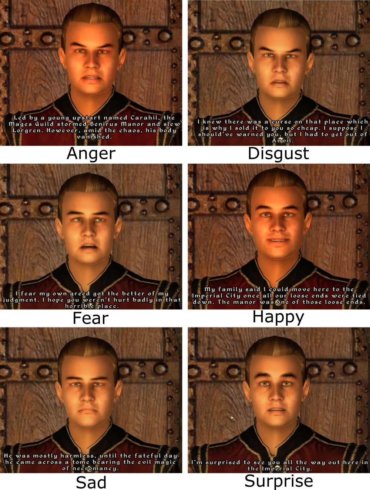

# Abstract

The emotional content of lines of dialogue from *Elder Scrolls IV: Oblivion* were analysed, testing various hypotheses about how their distribution might be biased by the gender of the speaking NPC. Support was found for the hypothesis that female NPCs are "backgrounded" (given a smaller range of emotional dialogue) and that emotions which are seen as more masculine were more likely to be given to male NPCs, and conversely emotions seen as more feminine were more likely to be given to female NPCs.


# Introduction

The data source for dialogue from *Elder Scrolls IV: Oblivion* (Bethesda Softworks, 2006) includes emotion and intensity cues for about 62,000 lines of dialogue. These were used by the game engine to dynamically animate the faces of the NPCs speaking the lines. They provide a window into the content of the dialogue and an opportunity to test how this content differs between genders.

The emotions are: Anger, Disgust, Fear, Happiness, Sadness, Surprise and 'Neutral'. The emotion intensity scores range from 0 to 100, though there are only 20 unique values. *Oblivion* contains dialogue for named NPCs (with a backstory, quests, etc.) and generic NPCs (e.g. guards). The main analysis only considers unique characters' lines of dialogue, since generic characters tended to have duplicated lines of dialogue for male and female NPCs.

We propose three hypotheses for how the distribution of emotions might be influenced by gender biases.

The first hypothesis derives from the observation that female characters are often "backgrounded" in video games. Carillo Masso (2011) studied imagery and dialogue from *Diablo* and *World of Warcraft*. It was found that masculine pronouns were used three times as frequently as feminine pronouns and there are no significant female characters in the main storyline of the game as portrayed in the game cinematics. Carillo Masso explains this using Fairclough (2003)'s notion of "backgrounding": the presence of female characters needs to be assumed and implied by the game player. Similarly, Miller and Summers (2007, p. 739), find that female characters were more often "supplemental" in video games. 

For this study, gender-biased "backgrounding" would predict that female NPCs would play a smaller range of roles and less important roles. This suggests that their dialogue would be more likely to be "neutral" than male dialogue and less likely to have any of the other emotions than male dialogue. By having a higher proportion of neutral utterances compared to other emotions, female characters would be more frequently excluded from the main 'drama' and emotional narrative of the game, thus instead fading into the background.

The second hypothesis is that the game will reflect the tendency (or the belief) in the real world for females to publicly express more emotions than males (Kring & Gordon, 1998; Jansz, 2000; Timmers et al., 2003). This would predict the opposite of the first hypothesis: that male NPCs would be more likely to express neutral emotions and less likely to express other emotions compared to females (except perhaps anger, see e.g. Fischer & Evers, 2011). 

The third hypothesis is based on the idea of gendered emotions: the distribution will reflect stereotypes and cultural beliefs about which emotions are more 'feminine' or 'masculine'. Stereotypically feminine emotions would include happiness, surprise, sadness, fear, and disgust, while sterotypically masculine emotions would include anger (see Brody & Hall, 2008). This would predict that female NPCs would be more likely to express all emotions except neutral and anger, compared to male NPCs. We note that this third hypothesis is independent of the first two: female dialogue might show less emotional diversity than male dialogue while at the same time males are more likely to display anger.

For the intensity scores, the "backgrounding" hypothesis would predict that female NPCs more "neutral" or "default" intensity. Alternatively, various studies (e.g. Robinson & Johnson, 1997) show that women are believed to express more intense emotions than men, which would predict that intensity scores for female NPCs would be higher than for male NPCs.

\newpage

Examples of facial emotion, from [https://www.youtube.com/watch?v=chalWNAUjp8](https://www.youtube.com/watch?v=chalWNAUjp8)

```{r, out.width = "500px"}

```

\newpage


```{r echo=F,eval=F,warning=F,message=F}
try(setwd("~/OneDrive - Cardiff University/Research/Cardiff/VideoGameScripts/project_public/analysis/Appendices/"))
```

# Load libraries

```{r warning=F,message=F}
library(rjson)
library(ggplot2)
library(lmtest)
library(sjPlot)
library(pander)
library(knitr)
library(quanteda)
library(quanteda.textstats)
library(entropy)
library(brms)
```

# Load data           

Load data and select only lines of dialogue:

```{r}
d = fromJSON(file="../../data/ElderScrolls/Oblivion/data.json")
d = d[[1]]

m = fromJSON(file="../../data/ElderScrolls/Oblivion/meta.json")
charGroups = m$characterGroups

emotions = data.frame(
  name = sapply(d,function(X){names(X)[1]}),
  cue = sapply(d,function(X){X[["_Emotion"]]}),
  gender = "Female",
  charType = "Unique",
  stringsAsFactors = F
)
dialogue = sapply(d,function(X){as.character(X[[1]])})
```

Assign gender, generic/unique and dialogue text to each observation from metadata:

```{r}
emotions[emotions$name %in% charGroups$male,]$gender = "Male"
emotions[emotions$name %in% 
           c(charGroups$GenericMale,
             charGroups$GenericFemale),]$charType = "Generic"
emotions[grepl("Generic",emotions$name),]$charType = "Generic"
```

`emotions` is now a data frame where each row is a line of dialogue and CharType is whether the character is a generic character or a named, unique character.

Parse emotion and intensity into separate columns:

```{r}
emotions$emotion = sapply(strsplit(emotions$cue," "),head,n=1)
emotions$intensity = sapply(strsplit(emotions$cue," "),tail,n=1)
emotions$intensity = as.numeric(emotions$intensity)
```

Select only unique characters (remove generic characters):

```{r}
dialogue.generic = dialogue[emotions$charType=="Generic"]
emotions.generic = emotions[emotions$charType=="Generic",]

dialogue = dialogue[emotions$charType=="Unique"]
emotions = emotions[emotions$charType=="Unique",]
```

Some example sentences:

```{r}
set.seed(106)
med = tapply(which(emotions$intensity==50),
             emotions[emotions$intensity==50,]$emotion,
             sample, size=1)

high = tapply(which(emotions$intensity==100),
             emotions[emotions$intensity==100,]$emotion,
             sample, size=1)
examp = data.frame(
  Emotion = rep(sort(unique(emotions$emotion)),each=2),
  Intensity = rep(c(50,100),times=length(sort(unique(emotions$emotion)))),
  dialogue = c(rbind(dialogue[med],dialogue[high])))
pander(examp)
```


\clearpage
\newpage

# Analysis

## Emotion categories

The tables below show the emotion cues assigned to male and female characters (raw numbers and proportionally by gender): 

```{r}
tab = table(emotions$emotion,emotions$gender)
colnames(tab) = paste(colnames(tab)," (N)")
propTab = prop.table(tab,margin=2)
colnames(propTab) = gsub("\\(N\\)","\\(%\\)",colnames(propTab))
kable(tab,"latex")
kable(round(propTab*100,1),"latex")
```


```{r echo=F}
dx = data.frame(
  n = as.vector(propTab),
  Gender = rep(c("Female","Male"),each=nrow(propTab)),
  Emotion = rep(rownames(propTab),2)
)
dx$Gender = factor(dx$Gender,levels = c("Male","Female"))
ggplot(dx, aes(fill=Gender,y=n, x=Emotion)) + 
    geom_bar(position="dodge", stat="identity") +
  ylab("Proportion of dialogue") +
  theme(legend.position = "top")
```

Basic chi square test of proportion of emotion types by gender:

```{r}
chiSqEmotion = chisq.test(tab)
chiSqEmotion
```

```{r echo=F}
p.val = round(chiSqEmotion$p.value,3)
if(p.val < 0.0001){ p.val = "0.0001"}else{p.val = paste("=",p.val)}
chiSqString = paste0("$\\chi^2$(",chiSqEmotion$parameter,
                     ") = ",round(chiSqEmotion$statistic,2),
                      ", p = ",p.val)
cat(chiSqString, file="../../results/latexStats/OblivionEmotionsByGenderChiSq.tex")
```

The distribution of emotions by gender is significantly different from what would be expected in a random distribution (`r chiSqString`). Male NPCs have a higher proportion of anger, disgust, and fear dialogue compared to female NPCs. Female NPCs have a higher proportion of neutral, sad and surprise dialogue compared to male NPCs. The proportion of happy dialogue is roughly the same.

We can formally test the "backgrounding" hypothesis by comparing neutral and non-neutral dialogue:

```{r}
emotions$neutral = factor(emotions$emotion=="Neutral",
                          levels=c(T,F),labels = c("Neutral","Non-neutral"))
tabN = table(emotions$neutral,emotions$gender)
kable(tabN,"latex")
pt = round(prop.table(tabN,2)*100,1)
colnames(pt) = paste(colnames(pt),"(%)")
kable(pt,"latex")
chiSqN = chisq.test(table(emotions$neutral,emotions$gender))
chiSqN
```

```{r echo=F}
p.valN = round(chiSqN$p.value,3)
if(p.valN < 0.0001){p.valN = "< 0.0001"}else{ p.valN = paste("=",p.valN)}
chiSqStringN = paste0("$\\chi^2$(",chiSqN$parameter,
                     ") = ",round(chiSqN$statistic,2),
                      ", p ",p.valN)
cat(chiSqStringN, file="../../results/latexStats/OblivionBackgroundingStats.tex")
```

Female NPCs have a significantly more likely to have neutral emotion dialogue than male NPCs (`r chiSqStringN`).

We can also formally test the gendered emotions hypothesis by creating a variable 'emotionGender' that is either masculine (for Anger) or feminine (for other non-neutral emotions). (this test is run on Non-neutral emotions only):

```{r}
emotions$emotionGender = "feminine"
emotions$emotionGender[emotions$emotion=="Anger"] = "masculine"

tabEG = table(emotions[emotions$emotion!="Neutral",]$emotionGender,
          emotions[emotions$emotion!="Neutral",]$gender)
kable(tabEG,"latex")
ptEG = prop.table(tabEG,2)
colnames(ptEG) = paste(colnames(ptEG),"(%)")
kable(round(ptEG*100,1),"latex")
chisqEG = chisq.test(tabEG)
chisqEG
```

```{r echo=F}
p.valEG = paste("=",chisqEG$p.value)
if(p.valEG<0.0001){p.valEG= "< 0.0001"}else{p.valEG = paste("=",p.valEG)}
chisqEGString = paste0("$\\chi^2$(",chisqEG$parameter,
                     ") = ",round(chisqEG$statistic,2),
                      ", p ",p.valEG)
cat(chisqEGString, file="../../results/latexStats/OblivionEmotionsGenderStats.tex")
```

There is a significant association between the gender of the NPC and masculinity/femininity of the emotion (`r chisqEGString`). Male NPCs are more likely to use masculine emotions (anger) than female NPCs, and female NPCs are more likely to use feminine emotions (happiness, sadness, surprise, fear and disgust). 

Testing the difference between the "backgrounding" and gendered emotions hypotheses is hard. The "neutral" emotions aren't masculine or feminine, and the analysis above removes them from the data. But this is the key distinction for the backgrounding hypothesis. So the two variables can't be put together in a regression, and the two analyses above were based on different data, so can't be compared directly. 

To address this, we create two regression models. The first model predicts the NPC's gender only based on neutral vs. non-neutral emotions. The second model uses a three-category variable that distinguishes "neutral" from "feminine" and "masculine". We then compare the fit of these models against each other. This effectively tests whether the prediction from the gendered emotions hypothesis helps predict the NPCs gender *over and above* the backgrounding hypothesis.

```{r}
emotions$emotionGender[emotions$emotion=="Neutral"] = "neutral"
mNeutral = glm(gender=="Female" ~ neutral, 
                data = emotions,family="binomial")
mEmGen = glm(gender=="Female" ~ emotionGender, 
                data = emotions,family="binomial")
lrtest(mNeutral,mEmGen)
```

The improvement in the model fit for the second model is significant. This suggests that we should prefer the second model: the distribution of emotions is best explained by considering both neutral and gendered emotions (hypothesis 1 and 3).

## Emotion intensity

The intensity of emotion cues in the Oblivion script is represented by a score from 0 – 100. However, there are only 20 unique values, and only 7 are used more than 1% of the time (see the histogram below).  

```{r}
emotions$intensityCategory = 
  cut(emotions$intensity,
     breaks=c(-1,49,51,99,101),
     labels=c("Low","Medium","High","Max"))
hist(emotions$intensity,breaks=seq(0,100,by=5))
```

These scores were split into categories in order to facilitate analysis. Scores from 0 to 49 were classed as 'low', from 49 to 51 as 'medium', from 51-99 as 'high' and 100 as 'max'. The tables below show how lines of dialogue are distributed across intensity categories and genders.

```{r}
tabI = table(emotions$intensityCategory,emotions$gender)
tabIprop = prop.table(tabI,2)
colnames(tabIprop) = paste(colnames(tabIprop),"(%)")
kable(tabI,"latex")
kable(round(100*tabIprop,1),"latex")
```


```{r echo=F}
dx2 = data.frame(
  n = as.vector(tabIprop),
  Gender = rep(c("Female","Male"),each=nrow(tabIprop)),
  Intensity = rep(rownames(tabIprop),2)
)
dx2$Gender = factor(dx2$Gender,levels = c("Male","Female"))
dx2$Intensity = factor(dx2$Intensity,levels = c("Low","Medium","High","Max"))
ggplot(dx2, aes(fill=Gender,y=n, x=Intensity)) + 
    geom_bar(position="dodge", stat="identity") +
  ylab("Proportion of dialogue") +
  theme(legend.position = "top")
```

```{r}
chiSqIntensity = chisq.test(tabI)
chiSqIntensity
```

```{r echo=F}
p.val = round(chiSqIntensity$p.value,3)
if(p.val < 0.0001){ p.val = "< 0.0001"} else{p.val = paste("=",p.val)}
chiSqIntensityString = paste0("$\\chi^2$(",chiSqIntensity$parameter,
                     ") = ",round(chiSqIntensity$statistic,2),
                      ", p ",p.val)
cat(chiSqIntensityString, file="../../results/latexStats/OblivionIntensityChiSq.tex")
```

The distribution of intensity categories by gender is significantly different from what would be expected in a random distribution (`r chiSqString`). Female NPCs are more likely to be given "Medium" intensity lines than male NPCs, and less likely to be given Low or High intensities. The proportion of "Max" intensities is roughly equal.

Treating the intensity scores as continuous, we find that the average intensity is about half a point lower for male NPCs than female NPCs. Below we test whether this is statistically significant using a permutation test (a t-test is not appropriate, since the distribution is not normal).

```{r}
trueDiff = diff(tapply(emotions$intensity,emotions$gender,mean))
trueDiff
permuteI = function(){
  diff(tapply(emotions$intensity,sample(emotions$gender),mean))
}
n = 10000
permutedDiff = replicate(n,permuteI())
p.value = sum(permutedDiff < trueDiff) / n
if(p.value==0){
  p.value = 1/n
}
z.score = (trueDiff- mean(permutedDiff)) / sd(permutedDiff)
paste("Permutation z =",round(z.score,2), ", p = ",p.value)
```

The result is not significant and the effect size for the continuous data is very small. The patterns may be better captured by the categorical analysis above.

\clearpage
\newpage

# Exploratory analyses

## Interactions between emotion and intensity

We explored the interaction between emotion type and intensity. For simplicity, we use the continuous measure of intensity in a binomial regression predicting the gender of the NPC:

```{r}
table(emotions$emotion,emotions$intensityCategory,emotions$gender)
emotions$FemaleNPC = factor(emotions$gender=="Female")
mCombo = glm(FemaleNPC ~ emotion* intensity,
            data = emotions,family="binomial")
plot_model(mCombo,"int",colors = c("blue","red"))
```

For anger, fear and sadness, increasing intensity is associated with a higher likelihood of being from a female NPC. For disgust, the opposite was true: higher intensity was associated with a higher likelihood of being from a male NPC.

\clearpage
\newpage

## Emotions per character

We looked at the range of emotions per character. It's possible that, while females may be more likely to exhibit neutral emotions, an individual female may be more likely to exhibit a greater range of emotions than an individual man. Or put it another way, a female may exhibit a range of emotions while a man may specialise in one emotion.

```{r}
LinesPerChar = as.vector(table(emotions$name))
emotionEntropy = tapply(factor(emotions$emotion), emotions$name, function(X){
  entropy(table(X))
})
emotionNum = tapply(factor(emotions$emotion),emotions$name,function(X){length(unique(X))})

ent = data.frame(name = names(emotionEntropy),
                 entropy= emotionEntropy,
                 emotionNum = emotionNum,
                 lines=LinesPerChar)
ent$lines.log = log(ent$lines)
ent$gender = emotions[match(ent$name,emotions$name),]$gender
ent$gender = factor(ent$gender,levels=c("Male","Female"))
contrasts(ent$gender) = contr.sum(2)/2
```

The table below shows the proportion of characters displaying only 1 emotion, 2 emotions, 3 emotions etc.

```{r}
table(ent$emotionNum,ent$gender)
prop.table(table(ent$emotionNum,ent$gender),2)

barplot(t(prop.table(table(ent$emotionNum,ent$gender),2)),
        beside = T,
        xlab="Number of emotions", 
        ylab = "Proportion of characters (within gender)",
        legend.text = c("Male","Female"),col=c("blue","pink"))
```

It looks like the distribution for males is more biased towards low ranges of emotions, while the distribution for females is slightly higher.

However, this effect might be confounded by the amount of dialogue. There is no significant effect of gender on the number of emotions displayed when the (log) number of lines is considered:

```{r}
mx = glm(emotionNum ~ lines.log+gender, data = ent, family="poisson")
summary(mx)
```

Similarly, looking at the entropy of emotions displayed per-character shows that females have higher entropy than males:

```{r}
t.test(ent$entropy~ent$gender)
```

However, this is also confounded by the number of lines of dialogue for each character. Below we show that there is no significant effect of gender when taking into account the (log) number of lines each character speaks.

```{r message=F,warning=F,error=FALSE,cache=TRUE}
# The entropy measure has a normal distribution,
# but also lots of characters who only display one emotion.
#  (entropy of zero)
# So we use a zero-inflated beta distribution.

# First, scale entropy to be between zero and 1
ent$entropy2 = ent$entropy / (max(ent$entropy)+0.00001)
bmx = brm(entropy2 ~ lines.log + gender,data=ent, family = "zero_inflated_beta")
summary(bmx)
plot_model(bmx,"pred")
```


\clearpage
\newpage

## Cues in angry dialogue

There was a difference between genders in the emotion and intensity. One of the biggest differences was for lines marked with the "anger" emotion. However, is there a difference between genders in the linguistic expression of these emotions? That is, do male and female characters express anger differently?

Below, we extract frequencies of profanities in male and female dialogue for lines tagged with the "anger" emotion. 

```{r}
dialogueAnger= dialogue[emotions$emotion=="Anger"]
anger = corpus(dialogueAnger,
               docvars = data.frame(
                 gender = emotions[emotions$emotion=="Anger",]$gender))
toks_nopunct <- tokens(anger, remove_punct = TRUE)
totalWords = table(toks_nopunct$gender)

dfmat <- dfm(toks_nopunct)
tstat_freq <- textstat_frequency(dfmat, n = 40)

swears = read.csv("https://gist.githubusercontent.com/tjrobinson/2366772/raw/97329ead3d5ab06160c3c7ac1d3bcefa4f66b164/profanity.csv",
                  stringsAsFactors = F,header = F)
swears = swears[,1]
swears = swears[!swears %in% c("snatch")]
nx = c("hell","dago","ass")
swears[!swears %in% nx]= paste0(swears[!swears %in% nx],"*")
swears = c(swears,"vermin","scum")
swears = dictionary(list(swears=swears))
toks_swears = tokens_keep(toks_nopunct,swears)
dfmat_swears <- dfm(toks_swears)
tstat_freq_swears <- textstat_frequency(dfmat_swears, groups = gender)

tots = sapply(unique(tstat_freq_swears$feature),function(X){
  z = tstat_freq_swears[tstat_freq_swears$feature==X,]
  f = z[z$group=="Female",]$frequency
  m = z[z$group=="Male",]$frequency
  c(Female = ifelse(length(f)==0,0,f),
    Male = ifelse(length(m)==0,1,m))
  })
tots = t(tots)
swearSums = colSums(tots)
tots = rbind(tots,TOTAL = swearSums)
tots = rbind(tots,TOTAL.PerThousand = 1000 * (swearSums/totalWords))
tots

chisqSwear = chisq.test(rbind(swearSums,totalWords - swearSums))
chiSqString = paste0("female frequency per thousand words = ",
                     round(tots[nrow(tots),1],1),
                     ", male frequency per thousand words = ",
                     round(tots[nrow(tots),2],1),", ",
        "$\\chi^2$(",chisqSwear$parameter,
        ") = ",round(chisqSwear$statistic,2),
        ", p = ",signif(chisqSwear$p.value,2))
cat(chiSqString,file="../../results/latexStats/OblivionSwearingChiSq.tex")
```


Male characters use profanities twice as often as female characters in angry dialogue (`r chiSqString`). 

\clearpage
\newpage

## Dialogue by generic NPCs

Oblivion also includes spoken dialogue by "generic" NPCs, for example guards. These lines are usually duplicated for each gender. For example, the phrase "It's time for you to go" is recorded for both generic Imperial male NPC and a generic Imperial female NPC (also for all other races in the game).

However, not all lines are duplicated. There are some unique lines of dialogue for generic characters.

```{r}
# Find unique dialogue
tab = table(dialogue.generic)
uniqueGenericDialogue = which(dialogue.generic %in% names(tab[tab==1]))
```

There are `r length(uniqueGenericDialogue)` unique lines of dialogue for generic characters. We can identify how these are distributed by gender:

```{r}
uniqueGenericDialogueByGender = rbind(
  Unique = table(emotions.generic[uniqueGenericDialogue,]$gender),
  Duplicated = table(emotions.generic[-uniqueGenericDialogue,]$gender))
kable(uniqueGenericDialogueByGender,"latex")
ugpt= prop.table(uniqueGenericDialogueByGender,2)
colnames(ugpt) = paste(colnames(ugpt),"(%)")
kable(round(ugpt*100,1),"latex")

chiSqUniqueGenericDialogue = chisq.test(uniqueGenericDialogueByGender)
chiSqUniqueGenericDialogue
```

There is a significant imbalance: generic male NPCs are more than four times more likely to be given unique lines of dialogue than generic female NPCs.

```{r}
p.val = round(chiSqUniqueGenericDialogue$p.value,3)
if(p.val < 0.0001){ p.val = "0.0001"}else{p.val = paste("=",p.val)}
chiSqString = paste0("$\\chi^2$(",chiSqUniqueGenericDialogue$parameter,
                     ") = ",round(chiSqUniqueGenericDialogue$statistic,2),
                      ", p = ",p.val)
cat(chiSqString, file="../../results/latexStats/OblivionUniqueGenericDialogueChiSq.tex")
```


We can also look at how the emotions are distributed:

```{r}
ugdByGenderAndEmotion = table(
  emotions.generic[uniqueGenericDialogue,]$emotion,
  emotions.generic[uniqueGenericDialogue,]$gender)

ugdByGenderAndEmotionProp = prop.table(ugdByGenderAndEmotion,2)

dxG = data.frame(
  n = as.vector(ugdByGenderAndEmotionProp),
  Gender = rep(c("Female","Male"),each=nrow(ugdByGenderAndEmotionProp)),
  Emotion = rep(rownames(ugdByGenderAndEmotionProp),2)
)
dxG$Gender = factor(dxG$Gender,levels = c("Male","Female"))
ggplot(dxG, aes(fill=Gender,y=n, x=Emotion)) + 
    geom_bar(position="dodge", stat="identity") +
  ylab("Proportion of dialogue") +
  ggtitle("Emotion distribution for unique lines by generic NPCs") + 
  theme(legend.position = "top")
```

The biggest differences between the named and generic characters are for females: they are less likely to have neutral emotions, are more likely to have happy and angry emotions. The differences between the two types of character are visualised below:

```{r}
dx$diff = 100*(dxG$n - dx$n)
ggplot(dx,aes(y=diff,fill=Gender,x=Emotion)) +
  geom_bar(position="dodge", stat="identity") +
  theme(legend.position = "top") +
  coord_flip() + 
  ggtitle("Emotion distribution for unique lines by generic NPCs") + 
  ylab("Difference between Named Char % and Generic Char %")
```


\clearpage
\newpage


\clearpage
\newpage

# Conclusion

Compared to Male NPCs, Female NPCs are statistically more likely to be given 'neutral' emotion cues with 'medium' intensity. This supports the hypothesis that female characters are "backgrounded". This may be because they have a narrower range of roles or are less relevant at the most 'emotional' or dramatic moments in the game. However, this hypothesis did not predict the finding that female NPCs would express more sadness and surprise.

We also found support for the gendered emotions hypothesis: female NPCs were more likely to express feminine emotions and male NPCs were more likely to express masculine emotions. However, this is mainly a test of anger versus the other (non-neutral) emotions. This hypothesis also does not predict the difference in neutral emotion lines.

We found no support for the hypothesis based on the belief that women express more emotion than men. However, there are some hints that emotion is expressed differently. For example, male NPCs were more likely to use curse words when expressing anger than female NPCs. Although it is often believed that, in the real world, men use curse words more frequently than women, some studies show no difference between genders (e.g. McEnery 2006, p. 29).

The patterns in the generic character dialogue require more analysis. Tellingly, there is less unique dialogue for female generic NPCs, fitting with the "backgrounding" hypothesis. 

# References

Bethesda Softworks (2006) The Elder Scrolls IV: Oblivion [Video Game]. Cheng. 

Brody, L. R.; Hall, J. A. (2008). "Gender and emotion in context". Handbook of Emotions. 3: 395–408.

Carillo Masso, I. 2011. The grips of fantasy: The construction of female characters in and beyond virtual game worlds. In: Ensslin, A.M., E ed. Creating Second Lives: Community, Identity and Spatiality as Constructions of the Virtual.  New York: Routledge, pp. 113-142.

McEnery, T. 2006. Swearing in English bad language, purity and power from 1586 to the present. London, New York: Routledge.

Fairclough, N. 2003. Analysing discourse : textual analysis for social research. New York: Routledge.

Fairclough, N. et al. 2011. Critical Discourse Analysis. In: Van Dijk, T.A. ed. Discourse Studies: A Multidisciplinary Introduction. 2 ed. London: SAGE Publications Ltd.

Fischer, A. H., & Evers, C. (2011). The social costs and benefits of anger as a function of gender and relationship context. Sex roles, 65(1), 23-34.

Jansz, J (2000). "Masculine identity and restrictive emotionality". Gender and Emotion. Gender and Emotion: Social Psychological Perspectives. pp. 166–186.

Kring, A. M.; Gordon, A. H. (1998). "Sex differences in emotion: expression, experience, and physiology". Journal of Personality and Social Psychology. 74 (3): 686–703.

Miller, M. K. and Summers, A. 2007. Gender Differences in Video Game Characters' Roles, Appearances, and Attire as Portrayed in Video Game Magazines. Sex roles 57(9), pp. 733-742. 

Timmers, M., Fischer, A. H., & Manstead, A. S. R. (2003). Ability versus vulnerability: Beliefs about men's and women's emotional behavior. Cognition and Emotion, 17, 41–63.

