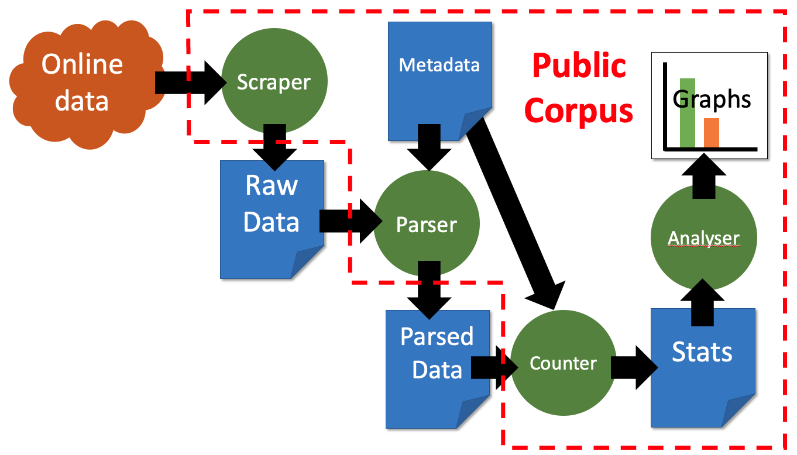
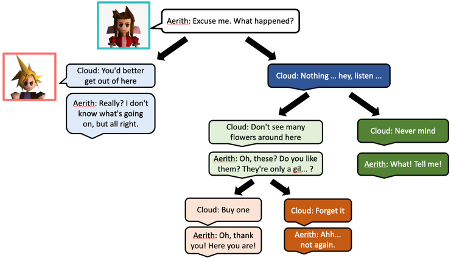
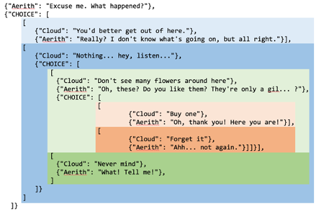

```{r echo=F,eval=F}
try(setwd("~/OneDrive - Cardiff University/Research/Cardiff/VideoGameScripts/project/writeup/"))
```


# Introduction

This document describes the design of the corpus, including the sample of games used, the software pipeline, the format of the data, and the error checking procedures.

# Corpus Design


```{r echo=F,message=F,warning=F,error=F}
library(rjson)
folders = list.dirs("../data", recursive = T)
folders = folders[sapply(folders,function(X){
  "meta.json" %in% list.files(X)
})]


allGames= NULL
for(folder in folders){
  js = fromJSON(file = paste0(folder,"/meta.json"))
  alternativeMeasure = FALSE
  if(!is.null(js$alternativeMeasure)){
    alternativeMeasure = js$alternativeMeasure
  }
  if(is.null(js$sourceFeatures)){
    js$sourceFeatures = list(
      type = "",
      completeness = ""
    )
  }
  if(!alternativeMeasure){
    allGames = rbind(allGames,
      data.frame(
        game = js$game,
        shortName = tail(strsplit(folder,"/")[[1]],1),
        series = js$series,
        year = js$year,
        source = js$source,
        source.type = js$sourceFeatures$type,
        source.completeness = js$sourceFeatures$completeness
      ))
  }
}
allGames = allGames[order(allGames$series,allGames$year),]

shortNameChanges = list(
  c("KingdomHearts", "KH"),
  c("KingsQuest", "KQ"),
  c("_Remake", "-R"),
  c("TheSecretOfMonkeyIsland", "MI1"),
  c("MonkeyIsland2", "MI2"),
  c("TheCurseOfMonkeyIsland", "MI3"),
  c("SuperMarioRPG", "SMario"),
  c("FFX_B", "FFX"),
  c("MassEffect1", "ME1"),
  c("MassEffect2", "ME2"),
  c("MassEffect3C", "ME3"),
  c("B$", ""),
  c("DS$", ""),
  c("StarWarsKOTOR","KOTOR"),
  c("DragonAgeOrigins","DAO"),
  c("_","")
)
for(snc in shortNameChanges){
  allGames$shortName = gsub(snc[1],snc[2],allGames$shortName)
}
```

50 games were selected for the corpus. All games were Role Playing Games (RPGs) with central mechanics for dialogue. They all have high sales figures: All games either individually sold, or belong to series that sold, at least 1 million copies worldwide. Every game or series frequently features in lists of the top RPGs of all time. For example,  [IGN's top 100 RPGs of all time](https://www.ign.com/lists/top-100-rpgs/100) and [Game Informer's top 100 RPGs of all time](https://www.gameinformer.com/b/features/archive/2018/01/01/the-top-100-rpgs-of-all-time.aspx) contain all the games in the corpus (or at least one game from each series). The exception is the King's Quest and Monkey Island games, which sold relatively poorly on release (compared to modern games) and are sometimes thought of as being "adventure games" or "point-and-click" games, though they fit the definition of RPGs. However, both of these series are frequently discussed as being highly influential on the medium (e.g. [https://latinamericanpost.com/35312-monkey-island-one-of-the-most-important-video-games-in-history](https://latinamericanpost.com/35312-monkey-island-one-of-the-most-important-video-games-in-history),  [https://gamerant.com/monkey-island-games-development-history-evolution-30-years/](https://gamerant.com/monkey-island-games-development-history-evolution-30-years/), [https://vocal.media/geeks/legacy-of-king-s-quest-in-modern-gaming](https://vocal.media/geeks/legacy-of-king-s-quest-in-modern-gaming), and [https://videogamesuncovered.com/features/a-history-of-kings-quest/](https://videogamesuncovered.com/features/a-history-of-kings-quest/)). The final requirement was that the games needed to have an accessible source of dialogue available. 

We aimed to collect a balance of games according to three factors. The first was RPG style, including Western RPGs and Japanese-style RPGs, since those are the dominant types. Secondly, the target audience age. For this latter, we used three categories based on the the official ESRB ratings: "Child" (ESRB ratings "Everyone", "Everyone 10+"), "Teen" (ESRB rating "Teen"), and "Adult" (ESRB ratings "Mature 17+" and "Adults Only 18+"). The table below shows the distribution of game series with the number of games in brackets.

| Rating | Western                                      | JRPG                      | Totals |
|--------|----------------------------------------------|---------------------------|--------|
| Child  | Stardew Valley, KQ, Monkey Island  (13)      | Super Mario RPG, KH (5)   | 18     |
| Teen   | Horizon Zero Dawn, Start Wars: KOTOR (2)     | Chrono-Trigger, FF (19)   | 20     |
| Adult  | Mass Effect, Elder Scrolls, Dragon Age (9)   | Persona (3)               | 12     |
| Totals | 24                                           | 26                        | 50     |

KQ = King's Quest; KH = Kingdom Hearts, FF = Final Fantasy.

Finally, we also aimed for a balance of games across time between 1985 and 2020:

```{r}
yBoundaries = c(1984,1989,1994,1999,2004,2009,2014,2021)
allGames$yearCat = cut(allGames$year,c(1984,1989,1994,1999,2004,2009,2014,2021),
                       include.lowest = T,
                       labels = paste(yBoundaries[1:7]+1,yBoundaries[2:8],sep=" - "))

x = tapply(allGames$shortName,allGames$yearCat,paste,collapse="; ")
n = tapply(allGames$shortName,allGames$yearCat,length)
xx = data.frame(Years = names(x),games = x, Num = n)
xx$Years = gsub(","," - ",xx$Years)
xx$Years = gsub("\\(","",xx$Years)
xx$Years = gsub("\\]","",xx$Years)
xx$Years = gsub("\\[","",xx$Years)
knitr::kable(xx,row.names = F)
```

Given the difficulties of balancing these three factors, and the constraint on being able to find dialogue sources, the corpus is relatively well balanced, at least at the game level. However, the corpus is not balanced in terms of number of words per game. There is a difference of two orders of magnitude between the game with most dialogue and the game with least dialogue. This is mainly an effect of the change in technology, storage capacity, and development budget for video games over the last three decades.

```{r}
gs = read.csv("../results/generalStats.csv",stringsAsFactors = F)
gs = gs[gs$alternativeMeasure=="False",]
gs = gs[gs$group=="TOTAL",]
knitr::kable(gs[order(gs$words),c("game","words")],row.names = F)
```

The distribution of words by RPG type is skewed towards Western RPGs:

```{r}
Wseries = c("Dragon Age", "Horizon", "King's Quest", 
            "Mass Effect","Monkey Island","The Elder Scrolls",
            "Star Wars: Knights of the Old Republic",
            "Stardew Valley")
rpgTypeWords = tapply(gs$words, gs$series %in% Wseries,sum)
rpgTypeWords = rbind(rpgTypeWords,paste0(round(100*prop.table(rpgTypeWords),2),"%"))
rpgTypeWords[1,] = format(as.numeric(rpgTypeWords[1,]), big.mark = ",")
colnames(rpgTypeWords) = c("JRPG", "WRPG")
knitr::kable(rpgTypeWords, row.names = F)
```

The distribution of ratings is skewed towards adult titles:

```{r}
ratings = c("Dragon Age" = "Adult", "Horizon"="Teen", 
            "King's Quest" = "Child", "Mass Effect" = "Adult",
            "Monkey Island" = "Child","The Elder Scrolls" = "Adult",
            "Star Wars: Knights of the Old Republic" = "Teen",
            "Stardew Valley" = "Child", "Chrono Trigger" = "Teen",
            "Final Fantasy" = "Teen", "Kingdom Hearts" = "Child",
            "Persona" = "Adult", "Super Mario RPG"= "Child")
gs$rating = ratings[gs$series]
ratingWords = tapply(gs$words, factor(gs$rating,levels = c("Child","Teen","Adult")),sum)
ratingWords = rbind(ratingWords,paste0(round(100*prop.table(ratingWords),2),"%"))
ratingWords[1,] = format(as.numeric(ratingWords[1,]), big.mark = ",")
knitr::kable(ratingWords, row.names = F)
```

The distribution is also biased towards the early 2000s:

```{r}
gs$YearCat = allGames[match(gs$game,allGames$game),]$yearCat
yWords = t(t(tapply(gs$words,gs$YearCat,sum)))
yWords = cbind(yWords, paste0(round(100*prop.table(yWords),2),"%"))
yWords[,1] = format(as.numeric(yWords[,1]), big.mark = ",")
colnames(yWords) = c("Words","%")
knitr::kable(yWords, row.names = T)
```


Despite these imbalances, we suggest that the corpus is still representative of an average gaming experience. In any case, deciding how to sub-sample each game to create a balanced corpus would depend on the particular research question and type of balance aimed for. For example, if the aim was to balance characters, character groups, certain stages of the game, or depth of dialogue tree. We incorporate as much of each game as possible, so that future studies can make their own decisions. 

Where balance is a key issue for statistical methods, we run additional analyses on a random sub-sample where each game has the same number of lines of dialogue (see further below), or calculate measures of dialogue in words per-thousand words within a game.

## Sources

The dialogue scripts were sourced from a variety of source types, including public fan transcripts, public wikis and directly from game data. They also varied in completeness from "complete" (virtually all dialogue that a player could experience), to "high" (most dialogue a player would experience on a typical play-through of a game), and "sample" (e.g. a single play-through of the game without alternative dialogue choices, or only transcriptions of portions of the game). See other sections of the SI for analyses of the reliability and representativeness of these sources.

We are very grateful for the work that fans put into organising these sources.

\clearpage
\newpage
Table of games and sources:
\tiny 
```{r echo=F}
knitr::kable(allGames[,c("game","year","source","source.type","source.completeness")], row.names = F,col.names = c("Game","Year","Source","Type","Completeness"))
```
\normalsize

\clearpage
\newpage

# Corpus pipeline

The pipeline for converting the original sources into the standard format involves several steps:

1.  Scrape the online source data into temporary local files.
2.  Parse the local files into a standard format using a custom parser, and clean and unify the character names using metadata (see below).
3.  Count words and other statistics in the parsed data to produce statistics.
4.  Analyse the statistics into formal tests and visualisations.

The corpus pipeline is visualised below:



We approach these tasks using replicatable methods in order to create a "self-inflating corpus". The entire pipeline for each game is implemented in python and R code. This means that we can release the code and metadata publicly as a github repository. Now, other researchers can re-run the code in order to re-create the corpus, without needing to share copyrighted materials directly. In addition, the corpus can continue to be expanded and edited in a centralised and consistent way.

The pipeline is set up so that a single parser can be applied to several games. The hope was that code could be re-used. In reality, nearly every game needed its own special parser because of the specifics of the source format or game mechanics. As a result, the parsers account for 10,000 lines of code in the repository. The metadata has around 28,000 lines of gender coding and character name unification details.

\clearpage
\newpage

# Standard format for video game dialogue

The canonical form of the data in the corpus is a JSON format. This is a plain text format that can be read with an ordinary text editor or any open-source JSON tool. This format was chosen because: it can capture pairings of data and recursive structures; is portable and open-source; it is machine-readable (e.g. it is compatible with python dictionaries); and it looks like a screenplay script to human readers.

The script for a game is a list of dictionaries. Each dictionary has a main key which represents the name of the character who is speaking. The value associated with this key is the dialogue they speak. Below is an example of three lines of dialogue from Final Fantasy VII between the characters Barret and Cloud:

```{json}
[
{"Barret": "The planet's full of Mako energy. People here use it every day."},
{"ACTION": "Cloud shrugs."},
{"Barret": "It's the life blood of this planet."},
{"Cloud": "I'm not here for a lecture. Let's just hurry."}
]
```

According to the JSON format, square brackets enclose a list of items separated by commas, and curly brackets enclose a set of key:value pairs.

There are a number of reserved main keys that indicate particular kinds of information. These include:

-  ACTION: the value is a description of the action (see the example above). 
-  LOCATION: the value is a description of the location.
-  SYSTEM: the value is a transcription of non-diegetic text that appears to the player, but is not spoken by in-game characters. This includes menu text and tutorial text.
-  CHOICE: a branching choice (see below)
-  GOTO: The script continues at another location (see below)
-  STATUS: A description of some contextual status, used to interpret branching choices (see below)

The dictionary can optionally include other keys, as long as they begin with an underscore, which might convey contextual information. In the example below from Oblivion, the extra data includes the race of the character, the emotion information assigned to the face animator, and the quest ID that this dialogue appears within.

```{json}
{"Velwyn Benirus": "I got the door open. The rest is up to you.",  
    "_Race": "Imperial", 
    "_Emotion": "Fear 90", 
    "_Quest": "0000BCD7"}
```

Branching dialogue is handled using a recursive structure. The main key is labelled “CHOICE” and its value is a list of possible outcomes. Each outcome is a list of dialogue dictionaries, like the normal format. Any of the dialogue dictionaries can itself be a choice structure, allowing recursive branching. 

\clearpage
\newpage

Figures 2 and 3 show a recursive branching dialogue from Final Fantasy VII between Cloud (the player character) and Aerith. There are several possible binary choices, indicated by different shades of the same colour:




\clearpage
\newpage

Typically, each outcome will represent the consequences of a player choice. The first entry in each outcome will indicate the trigger for that outcome (e.g. choosing to buy a flower or not). However, the format is designed to capture any type of outcome, including those triggered by: game conditions (e.g. a certain quest is complete); player character statuses (e.g. player character is female); different possible character responses; or random choices. One outcome can be empty, indicating that there’s a possibility of hearing no additional dialogue. 

In the example below from Skyrim, Ralof responds differently based on the player character’s class:

```{json}
{"CHOICE": [
	[
		{"STATUS": "Player race/questline"},
		{"Ralof": "Mage, eh? Well, to each his own."}],
	[
		{"STATUS": "Player race/questline"},
		{"Ralof": "Warrior, good! Those stars will guide you to honor and glory."}],
	[
		{"STATUS": "Player race/questline"},
		{"Ralof": "Thief, eh? It's never too late to take charge of your own fate."}
	]
]}
```

Although a branching structure can technically represent all types of outcome, some games are more succinctly represented using a mix of branching structures and links between parts of this structure. To handle this, each dialogue dictionary can be given a unique ID (assigned to the key “_ID”). Then there is a reserved main key “GOTO” paired with an ID. This is an instruction that the script resumes at the dictionary with the given ID.

In the example below from Mass Effect 3, Din Korlack’s line changes depending on the gender of the player character Shepard. If Shepard is female, then the first outcome is experienced. If not, then the second outcome is experienced, but then there’s a GOTO line that rejoins the script at Zaeed’s first line. That is, the text dialogue experienced by the player is identical except for the pronouns.

```{json}
{"CHOICE": [
	[
		{"STATUS": "Shepard is female (12/0)"},
		{"Din Korlack": "Shepard's investigating. She's... a recent acquaintance.", "_ID": "689365"},
		{"Zaeed Massani": "How recent?", "_ID": "689367"},
		{"Din Korlack": "Very.", "_ID": "689368"},
		{"Zaeed Massani": "Shit. All right, I'm listening.", "_ID": "689369"}],
	[
		{"STATUS": " (-1/0)"},
		{"Din Korlack": "Shepard's investigating. He's... a recent acquaintance.", "_ID": "689366"},
		{"GOTO": "689367"}]]}
```

\clearpage
\newpage

# Metadata format

The metadata file is a JSON format file with the following fields:

-  "game": Full name of the game.
-  "series": Name of the series(e.g. "Final Fantasy").
-  "year": Year of publication.
-  "source": Web source for the raw script.
-  "sourceFeatures": What the source contains, see below.
-  "characterInfoSource" (optional): Source for a wiki-style listing for automatic extraction of character features. 
-  "sampleOnly" (optional): True if the source is only a small sample of the full script.
-  "notes" (optional): Any coder notes about the data.
-  "parserParameters": parameters for the parser. Must include "parser" (name of the parser that's used) and "fileType" (extension of files in the 'raw' folder to parse, 'html' by default). See the parsers for further arguments that can be passed.
-  "mainPlayerCharacters": list of main playable characters (e.g. ["Cloud"])
-  "characterGroups": Dictionary of groups and the characters that are members of each group (see below)
-  "aliases": A mapping from alternative names to canonical names. This helps the parser fix spelling mistakes and unify character dialogue written under alternative names, (e.g. before their name is known, `"Flower girl": "Aerith"`).

'sourceFeatures' is a dictionary with the following properties:

-  "type": One of 'fan transcript', 'game data', 'wiki'
-  "completeness": One of 'sample', 'high', 'complete'
-  "dialogueOrder": true (appropriate for studying transisions between speakers) or false (some other order, e.g. ordered by )
-  "choices": What is the coverage of dialogue choices?
	-  "NA" (game has no choices)
	-  "not included"
	-  "partial"
	-  "complete"
	
\clearpage
\newpage

## Character groups

The characterGroups field in the metadata is a mapping from group names to a list of character names who are members of that group. This is used to code each character's gender.

The group labels can be any string, and there can be as many groups as is necessary to capture the diversity in the character groupings. Character names should be the final canonical names, after the aliases are applied.

```json
	"characterGroups": {
		"male": [
			"Cloud",
			"Barret",
			...
			],
		"female": [
			"Tifa",
			"Aerith",
			...
			],
		"neutral": [
			"Chocobo",
			"Jenova",
			...
			],
		...
		}
```

## Aliases

Sometimes, a character has multiple names in the script. This can happen if: 

-  The character is disguised as another character (e.g. Prince Edgar is transformed into King Otar in King's Quest VII). 
-  The character speaks before revealing their name (e.g. Aerith in Final Fantasy VII) 
-  The name is shortened (e.g. "Red" instead of "Red XIII" in Final Fantasy VII) 
-  There are stage directions in the name (e.g. "Cara [to Mid]" in Final Fantasy V) 
-  There is variation in upper case/lower case letters (e.g. "Shinra manager" and "Shinra Manager"). 
-  There is a typo in the script. 

These issues can be fixed by adding alias information to the metadata. This is placed after the "characterGroups". It includes a list of 'wrong' names and what they should be corrected to. E.g. below all instances of "Flower girl" are converted to "Aerith". 

```json
"aliases": {
		"Flower girl": "Aerith",
		"Aries": "Aerith",
		"Muuki": "Mukki",
		"Red": "Red XIII",
		"Shinra manager": "Shinra Manager",
		"Village headman": "Village Headman",
		...
	}
```

Some scripts assign one line of dialogue to multiple characters if they're saying the same thing at the same time. This can lead to some 'character names' like "Cloud & Aerith". These can be split into individual lines for each character by using a list in the aliases (instead of just a character name string):

```json
"aliases": {
	"Cloud & Aerith": ["Cloud", "Aerith"],
	"Biggs, Jessie, & Wedge": ["Biggs","Jessie", "Wedge"]
	}
```

Sometimes, multiple characters are given the same label if they are not known to the transcriber or the player at the time of speaking. Characters can be identified by line of dialogue. In the example below, the label "???" is converted based on the line of dialogue. For example, if the dialogue matches "Ha ha ha ha. I'm so ... lonely", then it will be converted to "Birdo":

```json
"aliases":{
			"???": {
			  "Birdo": ["Ha ha ha ha. I'm so ... lonely.",
							  "Oh ... If you had played with me,",
							  "Thanks!"],
					"Jinx": ["You did well for your inexperience, Jagger."],
					  }
			}
```

Note that:

-  Matching is done by checking if the dialogue in the script *starts with* the line of dialogue in the metadata, so there's no need to include the whole line, just a recognisable portion.
-  If a line of dialogue in the script does not match any of the lines in the metadata, the name remains as it is.
-  Alias changes apply during parsing, so the incorrect names won't appear in the script. Therefore, when including aliases, the names in the "characterGroups" list should reflect the corrected name or individual name, not the original name.

\clearpage
\newpage

# Error checking

This section describes the procedure for error checking in order to ensure that the data is accurate and representative.

If the data source is directly from the game files, then only the check for false positives and parsing errors is required. Otherwise, both tests below are required.

After the checks have been carried out, the results should be added into the metadata after the “source” entry. for example:

```json
"errorChecks": {
  "truePositive_numTestsDone": "5",
  "truePositive_numParsingErrors": "0",
  "truePositive_numSourceErrors": "1",
  "truePositive_notes": "One line inaccurate transcript: [EXAMPLE]",
  "falsePositive_numTestsDone": "5",
  "falsePositive_numErrors": "1",
  "falsePositive_notes": "Parsing error: no space after full stop."
}
```

A Github issues should be raised for any problem that could potentially be fixed. 

## Check for true positives and transcription errors

Follow the procedure below to check for true positives (lines that are in the source that are in the game) compared with transcription errors (lines that may have been miss-transcribed in the source).

1. Find a video on YouTube of someone playing the game. Try to find one that documents an entire play through the game (rather than clips), without mods, and that is not a speed run or specialist run (e.g. pacifist). Typically, “let’s play” videos will be suitable.

2. If a run is split over several videos, choose one at random.

3. Choose a random place in the video. This website will help you do that: https://correlation-machine.com/VideoGameCorpus/randomVideoLocation.html 

4. Find the next piece of dialogue. If you reach the end of the video, loop around to the beginning. Look at up to three lines of dialogue that are spoken together.

5. Search the data.json file to answer:

-  Does the dialogue in the video exist in the corpus? (ignoring small errors in punctuation, capitalisation, and also ignoring typos - the question is whether the line is represented somehow)
-  Is the text of the transcript of the video accurate? Note that consecutive lines spoken by the same character are collapsed into one line in the corpus.
-  Is the structure of the conversation correct? (Are options defined in “CHOICE” structures? Are all options available? Does the sequence match?). Note that the dialogue in the game may be randomised, optional or status-dependent, so all lines in the corpus may not appear in the video. The question is whether the dialogue in the video is covered by the corpus.
-  If there are any errors, can we identify the source?
    -  Error in parsing program.
    -  Error in original transcript source.

Repeat steps 2-5 for 5 parts of the video.

## Check for false positives and parsing errors

Repeat the following procedure 5 times to check for false positives (lines in the source that are not really in the game) and parsing errors (lines that are in the data, but parsed incorrectly in terms of character assignment or dialogue structure).

Pick a random line in the corpus data.json file. Confirm that:

-  The character name is plausible (not some possible parsing error like “and so”).
-  There are no strange typographic characters.
-  There are no obvious parsing errors (e.g. another character’s dialogue line enclosed in the dialogue string, words not separated properly). If it is possible, find this line in the source transcript. This might involve finding the location of the source in the meta.json file, then using a google search like: "site:http://www.yinza.com/Fandom/Script/ “This is a church in the”"
-  Confirm that the line in the source has been correctly parsed into the corpus.


## Number of errors

As part of the error checking processes, and for other processes, 212 bug reports were filed to the Github repository and all were fixed.

The number of errors discovered in the corpus using the method above are summarised below. However, the process above used as a process of due diligence during development which was intended to find and fix errors. Therefore, they are not ideal as measures of the final quality of the data. Still, they demonstrate relatively low levels of error. We were initially concerned with the quality of transcription in fan transcripts, but this type of error was rare.

Load the data from meta.json files:

```{r}
library(rjson)
stats = read.csv("../results/generalStats.csv",stringsAsFactors = F)
# Remove alternative measures
stats = stats[stats$alternativeMeasure!="True",]
stats = stats[!is.na(stats$words),]
folders = unique(stats$folder)
d = NULL
for(folder in folders){
  js = fromJSON(file = paste0(folder,"meta.json"))
  if(!is.null(js$`error checks`)){
    errorChecks = js$`error checks`
    dx = data.frame(folder = folder,
       TruePosTestsRun = errorChecks$truePositive_numTestsDone,
       TruePosTranscriptErrors = errorChecks$truePositive_numParsingErrors,
       TruePosSourceErrors = errorChecks$truePositive_numSourceErrors,
       FalsePosTestsRun = errorChecks$falsePositive_numTestsDone,
       FalsePosErrors = errorChecks$falsePositive_numErrors)
    d = rbind(d,dx)
  }
}
d$TruePosTestsRun = as.numeric(d$TruePosTestsRun)
d$TruePosTranscriptErrors[is.na(d$TruePosTranscriptErrors)] = "0"
d$TruePosTranscriptErrors = as.numeric(d$TruePosTranscriptErrors)
d$TruePosSourceErrors = as.numeric(d$TruePosSourceErrors)
d$FalsePosTestsRun = as.numeric(d$FalsePosTestsRun)
d$FalsePosErrors = as.numeric(d$FalsePosErrors)
```

Mean proportion of tests with parsing errors:

```{r}
d$propTranscriptionErrors = d$TruePosTranscriptErrors/d$TruePosTestsRun
mean(d$propTranscriptionErrors,na.rm=T)
```

Mean proportion of tests with source errors:

```{r}
d$propSourceErrors = d$TruePosSourceErrors/d$TruePosTestsRun
mean(d$propSourceErrors, na.rm=T)
range(d$propSourceErrors, na.rm=T)
```

Mean proportion of tests with false positive errors:

```{r}
d$propFalsePosErrors = d$FalsePosErrors/d$FalsePosTestsRun
mean(d$propFalsePosErrors, na.rm=T)
```

There were no transcription errors and only one false positive error logged during error checking. There were many issues during development, but these were identified by different means and fixed.

The main source of errors were source errors, which were observed in 17 games. For example, in the play-through video of Skyrim that was chosen, conversations with some NPCs were observed that were not in the source transcript (hence the "completeness" of this game being 'high' instead of 'complete'). Or for Monkey Island, the source only records one path through a dialogue tree, so there was dialogue that was not captured. Both of these cases were known limitations of the source.

Overall, the data exhibited high accuracy and representativeness. 
